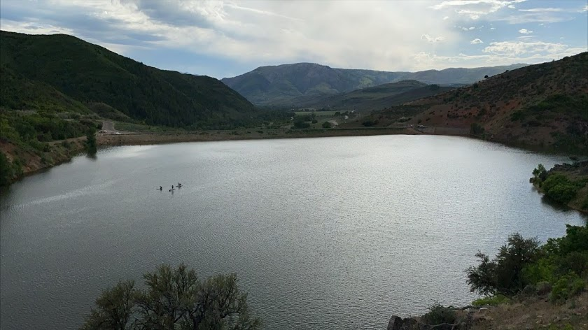
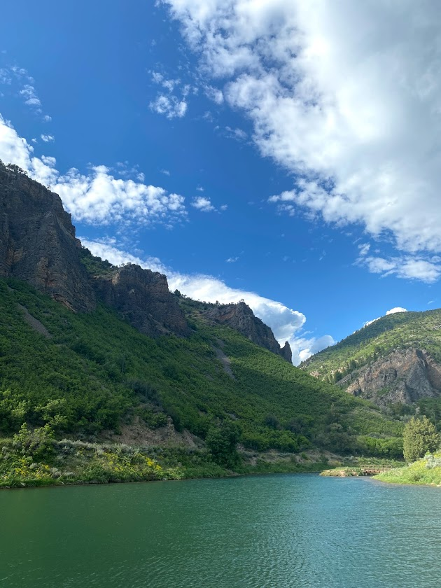

## Welcome to Craig's BeaUtahful Homepage

### About
Howdy! I'm Craig Baumgarten. I have spent the last 6 years working in San Francisco where I honed my skills as a software engineer. As of now, I am soul searching. Though technology is exciting, pays well, and is in high demand... I have come to the conclusion that the current pace of technology, when coupled with the unfettered morals of capitalism, is a dangerous predicament that nurtures an untenable societal and economic future.

With that in mind, I seek a balance between technology and its place within our economy. Selfishly speaking, I am yearn for a role that encourages technical innovation in harmony with the world's economy.

### What to Expect?
Well, I just moved to Ogden, UT in search of health, nature, and peace of mind. I plan to use the following website as a place for sharing, open thoughts, and photography.

Updates will be weekly.

### Topics
- Outdoors
  - Travel
  - Hikes
  - Camping
  - Kayaking
  - Rock Climbing
- Thought Blog
  - Thoughts
  - Musings
  - Quotes

### Recent Photos

#### Causey Reservoir

### Jekyll Themes

Your Pages site will use the layout and styles from the Jekyll theme you have selected in your [repository settings](https://github.com/crgbaumgart/hugo-test-site/settings). The name of this theme is saved in the Jekyll `_config.yml` configuration file.

### Support or Contact

Having trouble with Pages? Check out our [documentation](https://help.github.com/categories/github-pages-basics/) or [contact support](https://github.com/contact) and we’ll help you sort it out.
